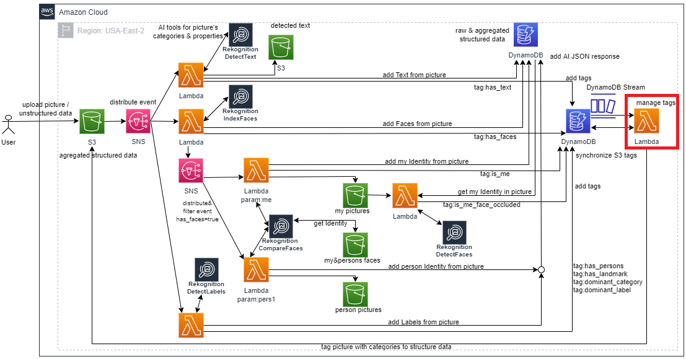

# AWS Lambda to tag pictures in S3

## 1. Overview

AWS S3 Service supports the tagging feature described [here](https://docs.aws.amazon.com/AmazonS3/latest/userguide/object-tagging.html). The best practices for tagging schemas are described [here](https://docs.aws.amazon.com/whitepapers/latest/tagging-best-practices/tagging-best-practices.html).
This Lambda take part from an application according to the below architecture where it is highlighted with red: manage tags.
  

## 2. Application functionality

Tags for the pictures are calculated by many Lambda microservices (orange squares in diagram), using invocations of AWS Machine Learning Rekognition service (black squares in diagram), and inserted into DynamoDB database (blue squares in diagram). Each Lambda calculate different tags, specified in the above diagram. These tags and the results of the ML invocations are stored in DynamoDB database.
When each record with tags is inserted into the database, DynamoDB sends an event to DynamoDB Stream. The events from this stream are forwarded to this Lambda. This Lambda waits for all the workers to complete, take all tags for one Picture, and tags the Picture in S3.

The red squares from diagram are topics, from Simple Notification Service, that distribute and filter the events to Lambda.   

The green squares from diagram are buckets, from Simple Storage Service, that store the initial Picture and the output of the Lambda workers (image and text files).  

The application is a Proof Of Concept for AWS ML Rekognition Service and also for a data concept: from unstructured to structured data. The unstructured data are the initial pictures that are uploaded by the User into S3. All the above lambda are triggered when each picture is uploaded into S3. The structured data are the output JSON structures of the AWS ML service, and the tags calculated by Lambdas.

## 3. AWS SDK features used
- Lambda handler supports messages from multiple sources that are detected in JSON: DynamoDB and SQS
- Lambda handler messages are received as JSON and converted to DynamoDB events
- Lambda handler output is returned to Lambda service as graph of POJO that are converted to JSON by Lambda service; when input event contains multiple records, the output contain one Response object for each record
- The log is done in all application using Log4j2, that sends output to AWS CloudWatch service
- Each AWS client used is encapsulated in a POJO application service
- The application uses a static client (connection) for each AWS service used; this connection is used by all the instances of the Lambda handler generated by Lambda service (AWS client is thread safe)
- All the Lambdas from the application use a common archive that contains the Tags Schema and Domain POJO (in libs folder: tagscommons-1.0.1.jar)
- Use DynamoDb Enhanced Client to query DynamoDB on Partition Key
- Use S3 Client to perform tags operations on S3 objects
- The JUnit4 tests use AWS messages from JSON files

## 4. Tag Schema
The Tag Schema used to tag one picture with the structured data from the same picture, was defined particularly for the business of this application: pictures taken by me in travels and exhibitions. An extensive example of how to define tags schemas could be found [here](https://docs.aws.amazon.com/whitepapers/latest/tagging-best-practices/defining-and-publishing-a-tagging-schema.html)
  
The content and versions of Tag Schema are presented in TagSchema.md file. S3 tagging system is limited to 10 tags for one Picture. The pictures are tagging automatically and consistent due to the schema and the application. This is a base condition for a valuable categorisation and query of the structured data. Below is the last version of the schema. The naming of the tags were chosen according to AWS best-practices, using a structured approach (hierarchy of concepts) and a strategy according to the business of personal data. The Use Case of the schema is Data Classification and Query. Other Use Cases could be found [here](https://docs.aws.amazon.com/whitepapers/latest/tagging-best-practices/tagging-use-cases.html)

#### Version 3_05.08.2023_9tags

| Tag    												| Possible values 							|
| -------- 												| ------- 									|
|personal:data:content:has_faces	 					| 1,2,3,4,5_max								|
|personal:data:content:has_faces:is_me 					| true										|
|personal:data:content:has_faces:is_me:face_occluded	| true										|
|personal:data:content:has_text							| true										|
|personal:data:content:labels:has_persons				| 1,2,3,...									|
|personal:data:content:labels:has_landmarks				| true										|
|personal:data:content:labels:dominant_category			| {AWS Rekognition category: 41 categories}	|
|personal:data:content:labels:dominant_label	 		| {AWS Rekognition label: 3000+ labels}		|
|personal:schema:version								| 3_05.08.2023_9tags						|

## 5. API documentation

The project has API documentation [here](javadoc/allpackages-index.html) (javadoc.html)

## 6. Test in Eclipse

The project has JUnit4 tests that can run using Eclipse feature Run As -> JUnit Test, on file /src/test/java/com/amazonaws/lambda/mihai/tagpicture/test/AllTests.java
